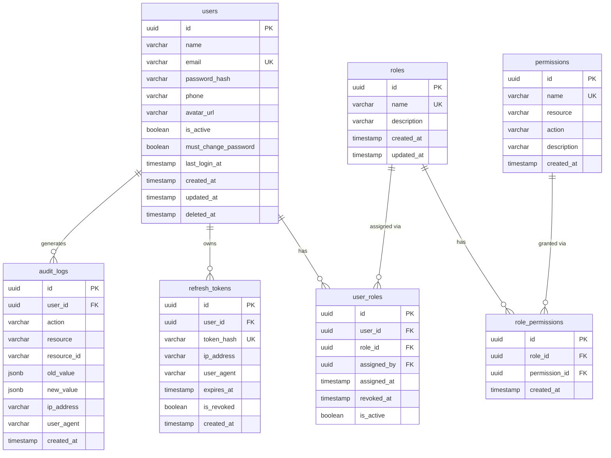

# Foundation Module — Database Schema
> **Phase 2: System Design** | Module 1 of 20
> Tables: `users`, `roles`, `permissions`, `role_permissions`, `user_roles`, `refresh_tokens`, `audit_logs`

---

## Entity Relationship Diagram



---

## Table Definitions

### `users`
Central identity table. Every person in the system is a user.

```sql
CREATE TABLE users (
    id                   UUID PRIMARY KEY DEFAULT gen_random_uuid(),
    name                 VARCHAR(100) NOT NULL,
    email                VARCHAR(255) NOT NULL UNIQUE,
    password_hash        VARCHAR(255) NOT NULL,
    phone                VARCHAR(20),
    avatar_url           TEXT,
    is_active            BOOLEAN NOT NULL DEFAULT TRUE,
    must_change_password BOOLEAN NOT NULL DEFAULT FALSE,
    last_login_at        TIMESTAMP WITH TIME ZONE,
    created_at           TIMESTAMP WITH TIME ZONE NOT NULL DEFAULT NOW(),
    updated_at           TIMESTAMP WITH TIME ZONE NOT NULL DEFAULT NOW(),
    deleted_at           TIMESTAMP WITH TIME ZONE  -- soft delete
);

CREATE INDEX idx_users_email ON users(email);
CREATE INDEX idx_users_is_active ON users(is_active);
```

---

### `roles`
Defines the 6 system roles.

```sql
CREATE TABLE roles (
    id          UUID PRIMARY KEY DEFAULT gen_random_uuid(),
    name        VARCHAR(50) NOT NULL UNIQUE,  -- 'super_admin', 'principal', etc.
    description TEXT,
    created_at  TIMESTAMP WITH TIME ZONE NOT NULL DEFAULT NOW(),
    updated_at  TIMESTAMP WITH TIME ZONE NOT NULL DEFAULT NOW()
);

-- Seed data
INSERT INTO roles (name, description) VALUES
    ('super_admin',   'Full system access'),
    ('principal',     'School-wide read + workflow approvals'),
    ('office_staff',  'Admissions, fees, documents'),
    ('teacher',       'Own classes: attendance, homework, marks'),
    ('parent',        'Their child data only'),
    ('student',       'Own profile, results, notices');
```

---

### `permissions`
Granular permission definitions using `resource:action` pattern.

```sql
CREATE TABLE permissions (
    id          UUID PRIMARY KEY DEFAULT gen_random_uuid(),
    name        VARCHAR(100) NOT NULL UNIQUE,  -- e.g. 'students:read'
    resource    VARCHAR(50) NOT NULL,           -- e.g. 'students'
    action      VARCHAR(20) NOT NULL,           -- 'read' | 'write' | 'delete' | 'manage'
    description TEXT,
    created_at  TIMESTAMP WITH TIME ZONE NOT NULL DEFAULT NOW()
);

CREATE INDEX idx_permissions_resource ON permissions(resource);
```

---

### `role_permissions`
Maps which permissions each role has. Many-to-many.

```sql
CREATE TABLE role_permissions (
    id            UUID PRIMARY KEY DEFAULT gen_random_uuid(),
    role_id       UUID NOT NULL REFERENCES roles(id) ON DELETE CASCADE,
    permission_id UUID NOT NULL REFERENCES permissions(id) ON DELETE CASCADE,
    created_at    TIMESTAMP WITH TIME ZONE NOT NULL DEFAULT NOW(),
    UNIQUE(role_id, permission_id)
);
```

---

### `user_roles`
Links users to roles. Supports role history (soft revoke via `revoked_at`).

```sql
CREATE TABLE user_roles (
    id          UUID PRIMARY KEY DEFAULT gen_random_uuid(),
    user_id     UUID NOT NULL REFERENCES users(id) ON DELETE CASCADE,
    role_id     UUID NOT NULL REFERENCES roles(id) ON DELETE CASCADE,
    assigned_by UUID NOT NULL REFERENCES users(id),
    assigned_at TIMESTAMP WITH TIME ZONE NOT NULL DEFAULT NOW(),
    revoked_at  TIMESTAMP WITH TIME ZONE,
    is_active   BOOLEAN NOT NULL DEFAULT TRUE
);

CREATE INDEX idx_user_roles_user_id ON user_roles(user_id);
CREATE INDEX idx_user_roles_active  ON user_roles(user_id, is_active);
```

---

### `refresh_tokens`
Stores hashed refresh tokens to support rotation & revocation.

```sql
CREATE TABLE refresh_tokens (
    id          UUID PRIMARY KEY DEFAULT gen_random_uuid(),
    user_id     UUID NOT NULL REFERENCES users(id) ON DELETE CASCADE,
    token_hash  VARCHAR(255) NOT NULL UNIQUE,  -- bcrypt/sha256 hash of the token
    ip_address  VARCHAR(45),
    user_agent  TEXT,
    expires_at  TIMESTAMP WITH TIME ZONE NOT NULL,
    is_revoked  BOOLEAN NOT NULL DEFAULT FALSE,
    created_at  TIMESTAMP WITH TIME ZONE NOT NULL DEFAULT NOW()
);

CREATE INDEX idx_refresh_tokens_user_id    ON refresh_tokens(user_id);
CREATE INDEX idx_refresh_tokens_token_hash ON refresh_tokens(token_hash);
```

---

### `audit_logs`
Immutable log of all write operations in the system.

```sql
CREATE TABLE audit_logs (
    id          UUID PRIMARY KEY DEFAULT gen_random_uuid(),
    user_id     UUID REFERENCES users(id) ON DELETE SET NULL,
    action      VARCHAR(20) NOT NULL,   -- 'CREATE' | 'UPDATE' | 'DELETE'
    resource    VARCHAR(50) NOT NULL,   -- e.g. 'students', 'fees'
    resource_id VARCHAR(36),            -- ID of the affected record
    old_value   JSONB,                  -- snapshot before change
    new_value   JSONB,                  -- snapshot after change
    ip_address  VARCHAR(45),
    user_agent  TEXT,
    created_at  TIMESTAMP WITH TIME ZONE NOT NULL DEFAULT NOW()
    -- NO updated_at, deleted_at — logs are immutable
);

CREATE INDEX idx_audit_logs_user_id    ON audit_logs(user_id);
CREATE INDEX idx_audit_logs_resource   ON audit_logs(resource);
CREATE INDEX idx_audit_logs_created_at ON audit_logs(created_at DESC);
```

---

## Design Notes

| Decision | Reason |
|----------|--------|
| UUID as primary keys | Avoids sequential ID enumeration attacks |
| `deleted_at` soft delete on `users` | Academic records must never be hard-deleted |
| Token hash stored (not raw token) | Even if DB is breached, tokens can't be reused |
| `audit_logs` has no `updated_at` / `deleted_at` | Logs must be immutable by design |
| `jsonb` for `old_value`/`new_value` | Flexible — works for any resource type |
| `role_permissions` in DB (not hardcoded) | Allows permission changes without code deployment |
